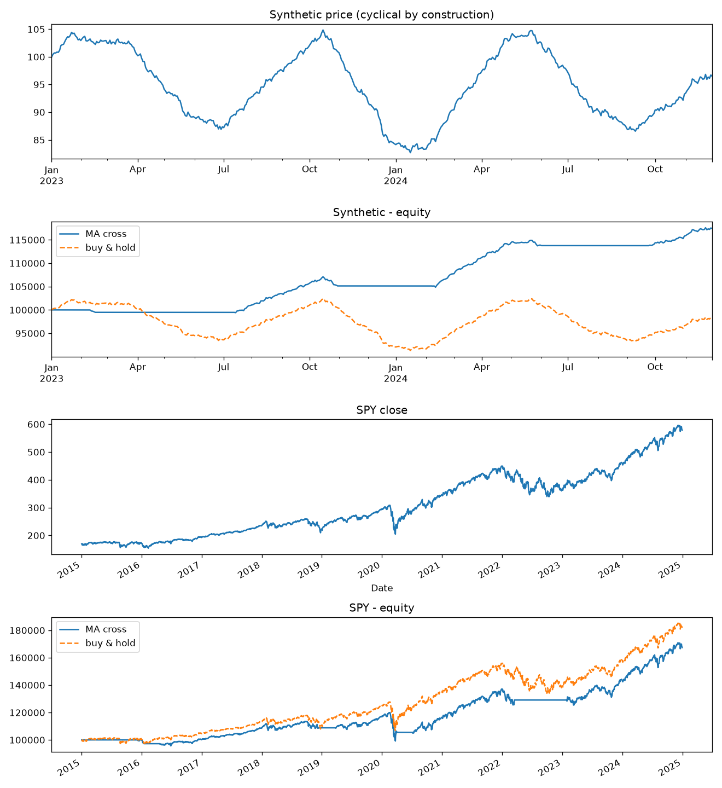

# Event-Driven Backtesting Engine

A backtester built the way production trading systems are built: components that talk to each
other only through a queue of events, processing one timestamp at a time. No component can see
the future, because the future hasn't been pushed onto the queue yet.

Roughly 300 lines of source, 18 tests, and one uncomfortable result — see
[RESULTS.md](RESULTS.md). Interview notes are in [INTERVIEW.md](INTERVIEW.md).

```bash
pip install -r requirements.txt
python -m pytest -q          # 18 passed
python run_backtest.py       # synthetic + SPY, writes engine_backtest.png
```



---

## How it works

### The problem with the obvious approach

The natural way to backtest in pandas is **vectorized**: compute a signal column, shift it,
multiply by a returns column, take a cumulative product. It's fast and fine for research, but
it has three structural problems.

- **Lookahead is one typo away.** The entire price series exists in memory as a column. Forget
  a `.shift(1)` and you are trading on a close you couldn't have known. Nothing crashes; your
  Sharpe just quietly triples.
- **Order handling doesn't map to column arithmetic.** Partial fills, limit orders, stops,
  position limits, latency — none of these are expressible as elementwise operations on a
  Series.
- **The research code looks nothing like the live code.** Going to production means a rewrite,
  and a rewrite means a fresh set of bugs in the one place you can least afford them.

### The event-driven alternative

Process one bar at a time, through a queue. Five components, four message types:

```
DataHandler --MarketEvent--> Strategy --SignalEvent--> Portfolio
                                                          |
     Portfolio <--FillEvent-- ExecutionHandler <--OrderEvent
```

| Event | Meaning | Emitted by |
|---|---|---|
| `MarketEvent` | a new bar arrived (timestamp only) | DataHandler |
| `SignalEvent` | an *opinion*: long / short / exit this symbol. No size. | Strategy |
| `OrderEvent` | a *decision*: buy or sell N shares (signed) | Portfolio |
| `FillEvent` | what actually executed: quantity, price after slippage, commission | ExecutionHandler |

The separation is the design. Strategies express views. The portfolio turns views into sized
orders — **this is where risk management lives**. The execution handler models market frictions.
In a real shop these are three systems owned by three teams, and the interfaces between them are
exactly these four messages.

The engine itself is two nested loops:

```python
while data.has_more():
    events.put(data.next_bar())          # outer loop: time

    while not events.empty():            # inner loop: causality
        event = events.get()
        dispatch(event)                  # handlers may push new events

    portfolio.mark_to_market(data.current_time())
```

The outer loop is time. The inner loop is causality: one bar can cascade into a signal, an
order, and a fill, and all of it must settle before the bar's equity is stamped. Getting
`mark_to_market` on the wrong side of that inner loop is the single most common bug in
hand-rolled backtesters — your equity curve lags reality by exactly one bar, which looks
plausible and is wrong. `tests/test_engine.py` checks the final number to the cent specifically
to catch it.

### How lookahead is prevented structurally

`HistoricalDataHandler` keeps a cursor. `get_latest(symbol, n)` slices only up to that cursor,
and **there is no method on the class that returns unreleased data**. The strategy is not
trusted to avoid the future; it is not offered the future. That's the difference between a
convention and a guarantee, and it's worth stating that way in an interview.

A side effect: during warmup, `get_latest` returns *fewer* rows than asked for. Strategies must
handle a short series rather than assume the window is full — the MA-cross strategy simply emits
nothing until it has `long_window` bars.

### The strategy: moving-average crossover

Long when the 50-day mean is above the 200-day mean, flat otherwise. It is a trend-following
strategy in its simplest possible form, chosen because it is easy to reason about, not because
it works.

The one non-obvious detail: **signal on the crossing, not on the state.** If the strategy emits
LONG on every bar where the short MA sits above the long MA, the portfolio sees hundreds of
redundant signals and pays commission on the churn. The strategy tracks what it has already
signalled in a set, so LONG fires once per crossing.

### Frictions

Buys fill *above* the close, sells fill *below*, by `slippage_bps`. Slippage always hurts —
that asymmetry is the entire model. Commission is per share.

Filling at the close of the bar you signalled on is optimistic: you observed the close and then
traded at it. A stricter model fills at the next bar's open. That's a deliberate, documented
modeling choice, not an oversight, and knowing to flag it is most of the point.

---

## Layout

```
├── run_backtest.py          # driver: synthetic + SPY
├── src/
│   ├── events.py            # the four frozen event dataclasses
│   ├── data_handler.py      # bar replay; enforces no-lookahead by construction
│   ├── strategy.py          # buy-and-hold + MA crossover
│   ├── portfolio.py         # sizing, cash/position accounting, equity curve
│   ├── execution.py         # fills with slippage + commission
│   └── engine.py            # the event loop
└── tests/                   # 18 tests, incl. an end-to-end check to the cent
```

Events are **frozen** dataclasses. Messages shouldn't mutate after they're sent; freezing them
means a downstream handler cannot rewrite history, and it makes them hashable and safe to log.

---

## Results in one line

On SPY 2015–2024 the 50/200 crossover returned **+67.4%** against buy-and-hold's **+81.7%**,
with a *worse* drawdown. On the synthetic sine wave it posted a Sharpe of 4.10. Same code, same
parameters. [RESULTS.md](RESULTS.md) is about why.

---

## Extending it

Each of these is a small, well-contained change, which is the point of the architecture:

- **Limit orders** — the execution handler needs a resting book (see the limit-order-book
  project) and fills become conditional on subsequent bars.
- **Next-bar-open fills** — queue the order and execute it on the following `MarketEvent`.
- **Position limits / stop losses** — pure portfolio-layer changes; no strategy edits.
- **Multiple symbols** — already supported; the loop iterates `data.symbols`.
- **Walk-forward parameter selection** — re-fit the MA windows on a rolling in-sample window.

## Known simplifications

Stated plainly, because a backtester that hides its assumptions is worse than no backtester.

- Fills are always complete, at the same bar's close, at any size. No liquidity constraint.
- Slippage is proportional to price, not to order size relative to volume.
- No borrow costs, no margin, no dividends beyond what `auto_adjust` bakes into the prices.
- Floats throughout. Real accounting systems use integer cents (`0.1 + 0.2 != 0.3`); the tests
  compare with tolerances instead.
- Single asset class, daily bars, one venue.

## Reading

- QuantStart, *Event-Driven Backtesting with Python* — the canonical free walkthrough of this
  exact architecture.
- [Backtrader](https://github.com/mementum/backtrader) and
  [Zipline](https://github.com/quantopian/zipline) — read the source *after* building your own;
  every component here has a counterpart there.
- Ernest Chan, *Quantitative Trading*, ch. 5 — backtesting pitfalls.
- Robert Pardo, *The Evaluation and Optimization of Trading Strategies* — walk-forward testing.
