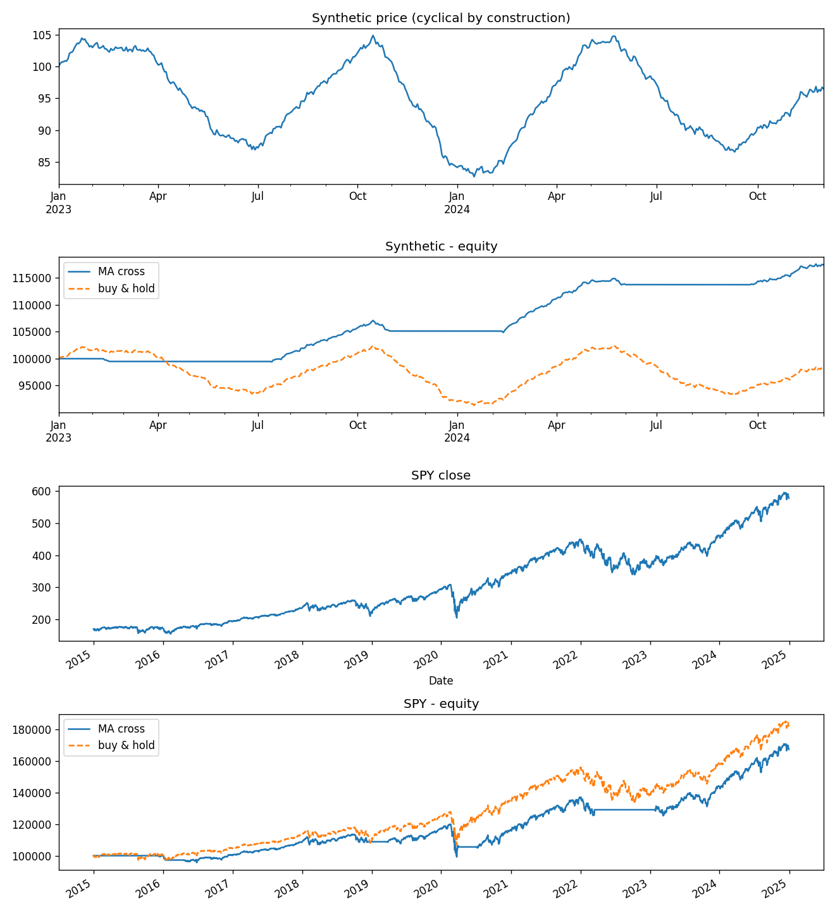
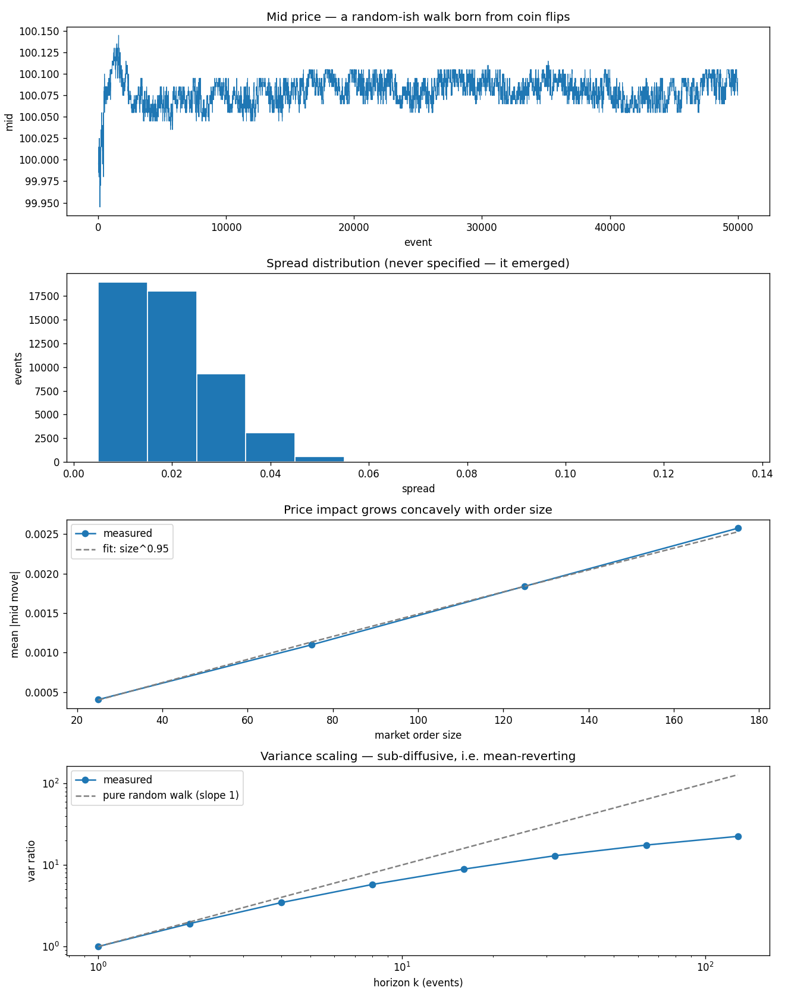

# Market Simulation Stack

**[Live site &rarr;](https://mihircoding.github.io/backtestingEngine/)** — the
equity curves, the trade log, the parameter grid, the emergent order-book
statistics, and a browser port of the matching engine you can send orders to.

Two halves of the same question, in one repository.

**`exchange/`** is a price-time priority matching engine — the piece of
infrastructure that *is* an exchange — plus a zero-intelligence order flow
simulator to run through it. The agents flip coins. The book still produces a
realistic spread distribution, concave price impact, and a mid price that
mean-reverts at short horizons the way real equity data does. None of that was
programmed in; it falls out of the matching rules.

**`src/`** is an event-driven backtester, built the way production trading
systems are built: components that talk to each other only through a queue of
events, one timestamp at a time. No component can see the future, because the
future has not been pushed onto the queue yet.

They were separate projects, and separately they both had the same hole in
them. A backtester has to decide what price your order filled at, and every
backtester in the world decides it with a formula — some basis points, maybe
scaled by order size. An order book does not need a formula. It knows what the
fill was, because it printed it.

**`src/book_execution.py` wires them together**: the backtester's orders go
into the matching engine, and the fill price is the volume-weighted average of
the resting orders the order actually consumed. Cost stops being a parameter
and becomes a consequence of depth.

The first thing that falls out is that the standard assumption is wrong in both
directions. A flat 2 bps on SPY overcharges a small order by a factor of five
and undercharges a 23-million-share order by a factor of fourteen; the two
cross at about 2% of a day's volume. The second thing is a flaw the comparison
exposed in the capacity study that was already here — its Sharpe ratio *rises*
above $5bn, because the participation cap stops filling and the statistic ends
up describing idle cash instead of a strategy. [RESULTS.md](RESULTS.md) has
both, and the correction.

261 tests.

```bash
pip install -r requirements.txt
python -m pytest -q                 # 261 passed

# the two halves together
python fill_realism.py              # fill models compared, the headline result

# the strategy side
python run_backtest.py              # synthetic + SPY, writes engine_backtest.png
python run_backtest.py --walk-forward    # refit the windows yearly, trade out of sample
python run_backtest.py --capacity        # how much money it holds, at 10% of volume
python run_backtest.py --significance    # bootstrap error bars, deflate the grid's best cell
python cross_section.py             # the same rule across 24 assets
python long_short.py                # and with a short leg, which makes it worse

# the venue side
python run_simulation.py            # 50k events, writes simulation.png
python benchmark.py                 # throughput and latency
python queue_study.py               # what a place in the queue is worth
python latency_study.py             # what a 15us disadvantage costs a market maker
python auction_study.py             # the opening auction, where the rules differ
```




## Layout

```
src/              the backtester: events, data handler, strategy, portfolio, execution
  book_execution.py   the bridge — execution that asks exchange/ what the fill was
exchange/         the matching engine: order book, order types, fees, latency, auction
tests/            backtester tests
  exchange/       matching engine tests
notes/            the two long write-ups, and the interview notes for each
RESULTS.md        the result that needs both halves
```

## Results

| | |
|---|---|
| [RESULTS.md](RESULTS.md) | fills simulated vs. assumed, and what the capacity study got wrong |
| [notes/backtester.md](notes/backtester.md) | costs, significance, walk-forward, sizing, capacity, 24 assets, long/short |
| [notes/exchange.md](notes/exchange.md) | spread, impact, mean reversion, fees, latency, auctions, queue value |
| [notes/interview-backtester.md](notes/interview-backtester.md) | how to talk about the strategy side |
| [notes/interview-exchange.md](notes/interview-exchange.md) | how to talk about the microstructure side |

The short version of all of it: the 50/200 moving-average rule loses to buy and
hold on SPY, loses across 24 assets, loses worse with a short leg added, and
does not survive an honest walk-forward. Those write-ups lead with that rather
than with the best cell of the parameter grid, and the engine exists to make
the negative result trustworthy rather than to find a positive one.

---

## How the two halves work

### The matching engine

An order book is two sorted collections of resting limit orders — bids below,
asks above — and the gap between the best of each is the **spread**. Everything
else is bookkeeping.

```
         asks (sellers)          Someone willing to sell at 101.00
  101.00 |████ 300              is offering; someone willing to buy
  100.60 |██ 150                at 100.50 is bidding. Nothing trades
  100.50 |█ 100     <- best ask  until one side reaches across.
  ---------------------- spread = 0.05
  100.45 |██ 200    <- best bid
  100.40 |████ 400
  100.30 |███ 250
         bids (buyers)
```

Two orders at the same price are not the same order. The one that arrived first
fills first, which is **price-time priority**, and section 8 of
notes/exchange.md prices what that priority is worth to the trader holding it.

### The event-driven backtester

The natural way to backtest in pandas is **vectorized**: compute a signal
column, shift it, multiply by a returns column, take a cumulative product. It
is fast and fine for research, and it has three structural problems.

- **Lookahead is one typo away.** The entire price series exists in memory as a
  column. Forget a `.shift(1)` and you are trading on a close you could not
  have known. Nothing crashes; your Sharpe just quietly triples.
- **Order handling does not map to column arithmetic.** Partial fills, limit
  orders, stops, position limits, latency — none of these are expressible as
  elementwise operations on a Series.
- **The research code looks nothing like the live code.** Going to production
  means a rewrite, and a rewrite means a fresh set of bugs in the one place you
  can least afford them.

The event-driven alternative is a queue. A `MarketEvent` releases one bar. The
strategy sees it and may emit a `SignalEvent`. The portfolio turns that into a
sized `OrderEvent`. The execution handler turns that into a `FillEvent`. Each
component can only read what has already been released, so lookahead is not
something to be careful about — it is unrepresentable.

### Why that matters for the bridge

Because the execution handler is just another component behind the queue,
swapping the one that applies a formula for the one that routes into a real
matching engine changes nothing else in the system. Four handlers now exist —
same-bar close, next-bar open, participation-limited, and the book — and they
differ in how the fill price is formed and in nothing else. That is what makes
them comparable, and comparability is the only reason the numbers in RESULTS.md
mean anything.
